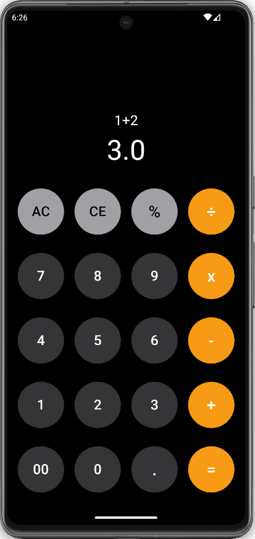

# Flutter Calculator

This is a simple calculator that allows users to perform basic arithmetic operations such as addition, subtraction, multiplication, and division, written in dart.

Thanks to [Eniola Adewale](https://dribbble.com/desi_gnsbytobi) for the [design](https://dribbble.com/shots/21001269-Calculator-UI-Design).

## Contributing

Feel free to fork the repository and submit pull requests.

## License

This app is open-source under the [MIT License](LICENSE). See the LICENSE file for more details.
